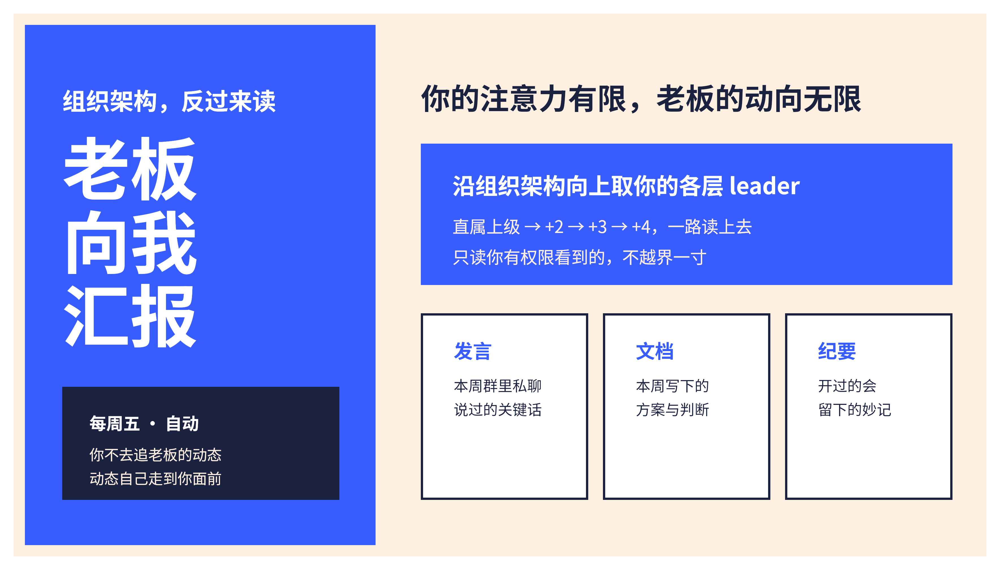
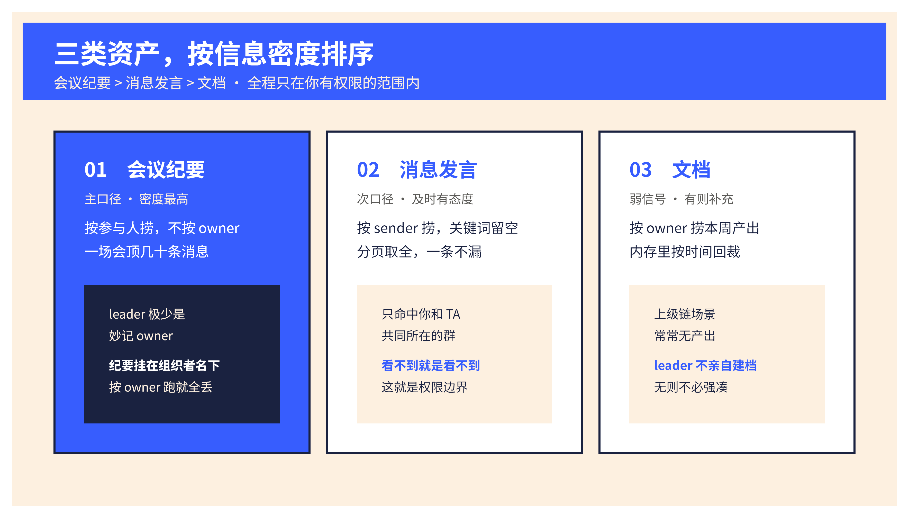
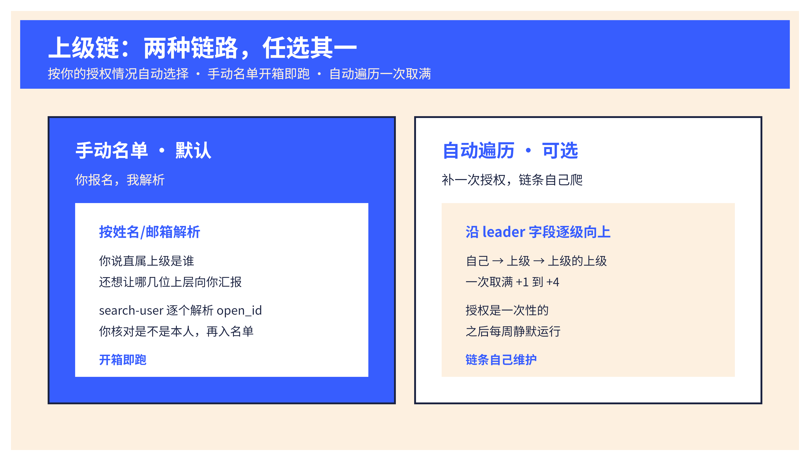
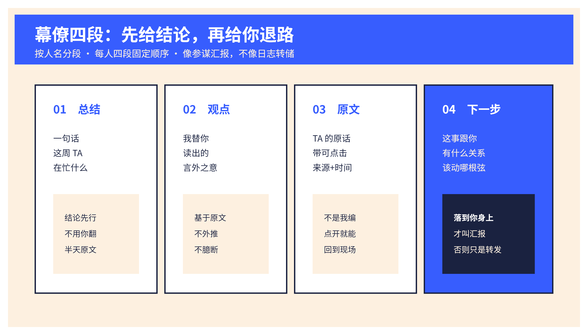

> 领导，请向我汇报！

<h1 align="center">老板向我汇报 · Boss Reports To Me</h1>

<p align="center">
  
  
  =3.8">
  
  
</p>

<p align="center">把组织架构反过来读：每周五，让你的各层 leader 自动向你汇报本周动态。</p>

---

汇报关系是单向的谎言。你每周对上汇报，却对上面在想什么一无所知——直到某个决定砸到你头上，你才后知后觉。信息不对称不是因为老板藏着掖着，是因为**你没有时间去逐个翻他们的飞书**。

这个 skill 把箭头调转过来。它沿着组织架构向上，把你的直属上级、上级的上级、一路到 +4 层，本周在飞书里**你本就有权限看到**的发言、文档、会议纪要，收集、去噪、成文，每周五主动推到你面前。你不再追动态，动态自己走过来。

<p align="center">
  
</p>

## 它解决什么

- **你看不见上面**：+1 到 +4 每周在忙什么、关注什么、口径变了没有，你靠零散撞见来拼。
- **翻飞书太贵**：真要一个个翻他们的群发言、文档、会议，一周的时间不够填。
- **转发不是汇报**：就算翻到了，一堆原文糊在一起，没有结论、没有跟你的关系，等于没看。

这个 skill 不是又一个信息聚合器。它是**你的参谋**：先替你读完，再告诉你结论、依据、以及你该动哪根弦。

## 三类资产，一个都跑不掉

证据只从一个地方来——**你本就有权限看到的飞书内容**。全程以用户身份（`--as user`）搜索，搜索结果天然只返回你有权访问的范围。这既是能力，也是不可逾越的隐私边界。

<p align="center">
  
</p>

| 资产 | 口径 | 关键纪律 |
|---|---|---|
| **发言** | 按 sender 捞本周消息，关键词留空、靠人+时间召回、分页取全 | 只命中你和 TA 共同所在的群；看不到就是看不到 |
| **文档** | 按 owner 捞本周新建/改动，内存里按时间精确回裁 | 剔除导入批量噪声，只留真实撰写 |
| **纪要** | 妙记 + 会议记录，按 owner/参会人捞，路由到正文取内容 | AI 摘要不当事实，缺一手佐证就停手 |

## 上级链：拿不到授权，也照跑不误

组织架构向上遍历是这个 skill 唯一的硬骨头。它用**双模式**啃下来，手动名单永远兜底。

<p align="center">
  
</p>

- **手动名单（默认）**：首次安装直接问你——直属上级是谁？还想让哪几位上层向你汇报？逐个用 `contact +search-user` 按姓名/邮箱解析成 open_id，你核对是不是本人，再入名单。**现有权限就够，零授权门槛，开箱即跑。**
- **自动遍历（可选）**：愿意补一次 `contact:contact.base:readonly` 授权，就能沿 `leader_open_id` 逐级向上一次取满 +1 到 +4。缺权限时**优雅回落**到手动模式，绝不报错崩溃。授权是一次性的，之后静默。

## 周报长这样：幕僚四段

按人名分段，直属在前、更上层在后。每人默认四段固定顺序——**总结 → 观点 → 原文 → 下一步**。像参谋汇报，不像日志转储。

<p align="center">
  
</p>

```
# 📮 老板向我汇报 · 本周（8/18–8/24）

> 本周你的老板们在关注什么：把 Q3 重心从交付整体转向续费。

### 张三（直属上级 · People CS）
📌 总结：本周把 Q3 重心从交付明确转向续费。
💡 观点：注意力从「签单」移到「留存」，下半年考核口径可能重排。
💬 原文：
  - "续费率下滑是下半年最大风险" — 8/21 部门周会 · [来源](url)
  - 《Q3 续费作战》文档 · 8/22 · [链接](url)
→ 下一步：把你手上的数字人方案提前挂到续费指标上。
```

三种风格一句话可切：默认 `chief`（幕僚四段），要更正式 → `sair`（咨询备忘录：情形/分析/洞察/建议），要轻松点 → `humor`（同四段、口吻更松）。

## 怎么用

前提：company 飞书账号，已装 `lark-cli` 并完成用户登录（`lark-cli auth status --json --verify` 确认 identity=user、租户正确）。

1. **首次安装**：让 agent 走「首次安装」——建 leader 名单、初始化调度（默认周五 17:00）、跑一份周报草稿先发你确认格式。
   ```bash
   # 解析一位 leader 并入名单
   lark-cli contact +search-user --as user --query "姓名或邮箱" --format json
   python3 scripts/roster.py add --name "张三" --open-id ou_xxx --level 直属上级
   python3 scripts/state.py init --report-time 17:00 --timezone Asia/Shanghai --weekday 4 --style chief
   ```
2. **每周跑**：取窗口 → 逐人采集 → 去重 → 成稿 → 推送给你本人 → 落盘防跨周重复。
   ```bash
   python3 scripts/state.py window --at "$(date -Iseconds)"
   python3 scripts/roster.py show
   ```
3. **开启定期运行**：让 agent 调用宿主自动化建「每周五」循环任务并回读下次触发时间（见 `references/scheduling.md`）。

对话里直接说「老板向我汇报」「本周我领导在忙什么」「上级动态周报」即可触发。

## 目录结构

```
boss-reports-to-me/
├── SKILL.md                    # 主流程：首次安装 / 每周跑 / 调整
├── LICENSE
├── agents/openai.yaml
├── scripts/
│   ├── state.py                # 调度 + 周窗口 + 去重指纹（隐私最小化）
│   ├── roster.py               # leader 名单增删查
│   └── leader_chain.py         # 可选：沿 leader 字段自动向上取 4 层
├── references/
│   ├── collection.md           # 三类资产采集命令 + 解析陷阱
│   ├── output-contract.md      # 周报结构：幕僚四段 + 三种风格
│   └── scheduling.md           # 周五定期运行范式
└── assets/                     # README 画板
```

## 边界与隐私

读的是「向上」的人，比读同级更敏感。这个 skill 守死几条线：

- **只用你本就有权限看到的内容**；无权限就在周报里明确标注，不臆造、不外推。
- **不给 leader 建人物档案**，不做绩效/能力判断，不用于监控。只做「本周动态摘要」，抽象成行为与主题。
- **原文不落盘、不进记忆**。`state.json` 只存调度参数和内容的 SHA-256 指纹（用于跨周去重）；`roster.json` 只存姓名/open_id/层级标签。两者均为私有 0600 文件。
- **不把 AI 会议摘要当事实**，缺一手佐证时停止下钻。
- 仅限本人自愿自读，company 与个人飞书严格隔离。

## 校验

```bash
# skill 就绪检查（frontmatter / 可移植性 / 隐私 / LICENSE）
python3 <skill-release-check>/scripts/check_skill_readiness.py . --json

# 脚本自检
python3 -m py_compile scripts/*.py
python3 scripts/state.py init --report-time 17:00 --timezone Asia/Shanghai --weekday 4 --style chief
```

## License

[MIT](LICENSE) © 2026 TongyiDai
